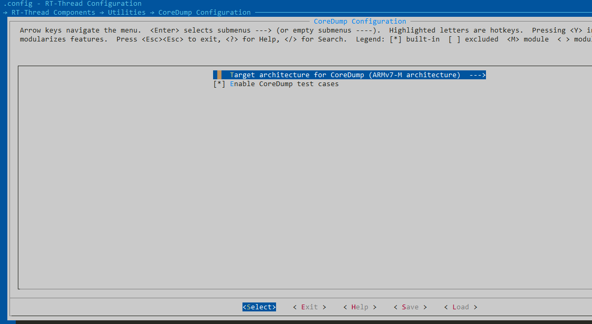
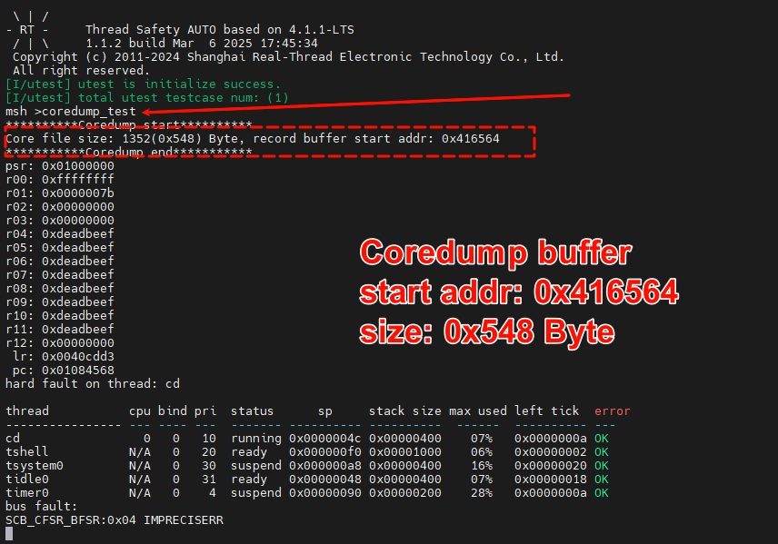
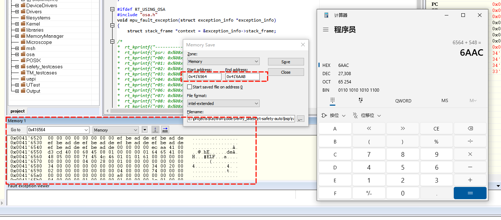
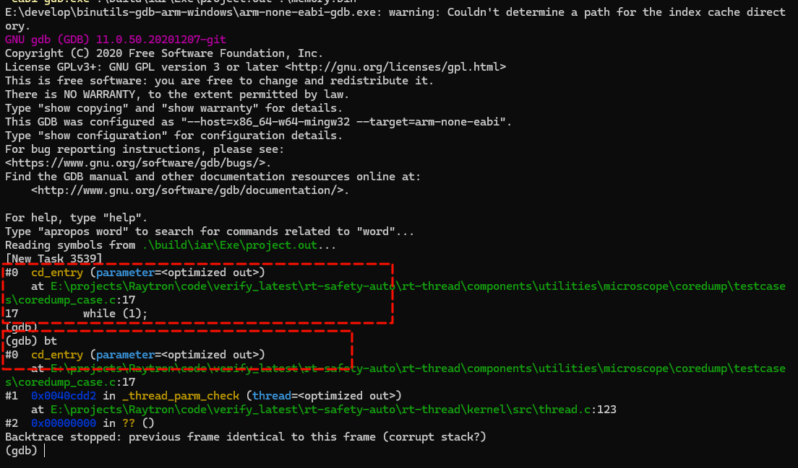

[toc]


# Coredump使用手册


## menuconfig配置使能相关组件

​		使能Coredump组件，选择与BSP对应的架构，使能测试用例（仅测试功能验证时使用），`menuconfig->RT-Thread Components->Utilities->[*]Enable CoreDump support`，配置如下图。




## 触发Coredump，利用调试工具从Flash导出Core文件

1. 在控制台输入命令触发Fault：`coredump_test`。
2. 控制台会输出Core文件的大小和记录Core文件数据Buffer的起始地址。

3. 在调试工具中导出Core文件（在IAR工具先暂停调试，然后在Memory窗口中单击鼠标右键选择Memory Save...），起始地址为<font color=blue size=5><b>0x416564</b></font>，导出长度为控制台打印出的信息，如上图<font color=blue size=5><b>0x548</b></font>。






## 利用GDB查看发生异常的函数

1. IAR工具中导出的是hex文件，所以需要先使用二进制工具objcpy将hex文件转bin文件。

   ```shell
   /* RT-Thread Env目录下有所需要的二进制工具，然后直接在bsp目录下执行该命令，注意将路径换成自己的工具路径 */
   $ C:\env_released_1.3.5\env-windows-v1.3.5\tools\gnu_gcc\arm_gcc\mingw\bin\arm-none-eabi-objcopy.exe -I ihex -O binary .\memory.hex .\memory.bin
   ```

   

2. 再使用修改过的GDB来查看。输入如下命令，<font color=blue size=5><b>project.out</b></font>文件为当前烧录的固件，<font color=blue size=5><b>memory.bin</b></font>为导出的core文件，然后输入`bt`即可查看fault的函数以及fault附近的行号。

   ```shell
   /* 同样在bsp目录下执行，注意需要使用我们释放的gdb */
   $ C:\develop\binutils-gdb-arm-windows\arm-none-eabi-gdb.exe .\build\iar\Exe\project.out .\memory.bin
   ```

   


